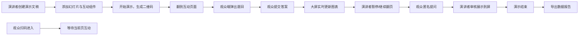

## 1. 产品概述

实时互动演示文稿工具，专为会议、课堂、培训场景设计，让演讲者能够在演示过程中实时与观众互动。
- 核心价值：打破传统PPT单向传递的局限，通过实时投票、词云、问答、评分等互动形式提升观众参与度
- 目标用户：讲师、培训师、会议演讲者、产品演示者

## 2. 核心功能

### 2.1 用户角色

| 角色 | 参与方式 | 核心权限 |
|------|----------|----------|
| 演讲者 | 创建演示文稿 | 创建/编辑幻灯片、插入互动组件、控制演示、导出数据报告 |
| 观众 | 扫码进入 | 实时互动（投票、提交关键词、提问、评分）、查看结果大屏 |

### 2.2 功能模块

1. **演讲者后台**：幻灯片管理、互动组件编辑、演示控制、问答管理、数据导出
2. **演示大屏**：幻灯片展示、实时互动图表、选中问题展示、二维码显示
3. **观众互动端**：扫码页面、互动答题、结果反馈

### 2.3 页面详情

| 页面名称 | 模块名称 | 功能描述 |
|-----------|-------------|---------------------|
| 演讲者后台首页 | 演示文稿列表 | 新建/打开/删除演示文稿，显示最近编辑记录 |
| 幻灯片编辑器 | 工具栏 + 画布 + 缩略图 | 添加/删除幻灯片，插入文本/图片，拖拽布局 |
| 互动组件面板 | 组件选择 + 属性编辑 | 选择题投票、词云、问答收集、评分滑块4种组件的插入与配置 |
| 演示控制页 | 幻灯片预览 + 控制按钮 | 上一页/下一页、暂停/继续、显示二维码、结束演示 |
| 问答管理面板 | 问题列表 + 操作 | 审核匿名提问、展示到屏、标记已回答、删除 |
| 数据报告页 | 统计概览 + 详细数据 | 参与人数、每题回答分布、导出CSV/PDF |
| 观众互动首页 | 二维码 + 输入框 | 扫码/输入房间码进入互动 |
| 观众互动页 | 动态答题区 | 根据当前幻灯片自动展示对应互动题目，提交后显示状态 |

## 3. 核心流程

演讲者创建演示文稿，添加幻灯片并插入互动组件 → 开始演示，生成房间码和二维码 → 观众扫码加入 → 演讲者翻到互动页面时观众端自动弹出题目 → 观众提交，大屏实时显示结果图表 → 演讲者可暂停等待数据稳定 → 观众可随时匿名提问，演讲者选择性展示 → 演示结束导出完整数据报告

## 4. 用户界面设计

### 4.1 设计风格
- **主色**：深蓝靛青 #1E3A8A（专业感），辅助色：青绿 #0D9488（互动高亮），强调色：橙 #F97316（数据可视化）
- **按钮风格**：圆角8px，hover状态有阴影加深，primary按钮使用渐变
- **字体**：标题使用"DM Serif Display"衬线体增添质感，正文使用"Plus Jakarta Sans"无衬线体保证清晰
- **布局风格**：卡片式布局配合玻璃拟态效果，工具栏固定顶部，画布居中，缩略图左侧停靠
- **图标风格**：统一使用lucide-react线性图标，1.5px线宽

### 4.2 页面设计概览

| 页面名称 | 模块名称 | UI元素 |
|-----------|-------------|-------------|
| 幻灯片编辑器 | 工具画布 | 顶部工具栏半透明磨砂效果，左侧缩略图带激活边框，画布白色卡片带阴影，右侧属性面板可折叠 |
| 互动组件面板 | 4种组件卡片 | 组件卡片带图标预览，hover时轻微上浮，选中后渐变边框高亮 |
| 演示大屏 | 全屏展示 | 深色背景配渐变光晕，全屏幻灯片居中，图表动画流畅过渡，右下角悬浮二维码 |
| 问答管理面板 | 问题卡片列表 | 卡片展开动画，"展示"按钮脉冲动画，已回答标记带渐变勾选 |
| 数据报告页 | 统计仪表盘 | 数据卡片带数字滚动动画，图表使用Recharts带渐变填充 |
| 观众互动页 | 移动端优化 | 全宽卡片式布局，大点击区域，提交按钮脉冲反馈，成功状态带粒子动效 |

### 4.3 响应式设计
- 演讲者端：桌面端优先设计，平板尺寸可使用但不保证最佳体验
- 观众端：移动优先设计，确保手机访问体验流畅，同时兼容桌面浏览器扫码后使用
- 演示大屏：自适应任意分辨率全屏显示，16:9为最佳比例

### 4.4 视觉动效
- 数据图表渲染时使用渐入动画
- 投票结果更新时柱状图高度平滑过渡
- 词云词汇出现时使用弹性缩放动画
- 页面切换时使用淡入淡出 + 轻微位移
- 观众提交成功后按钮粒子爆炸效果
