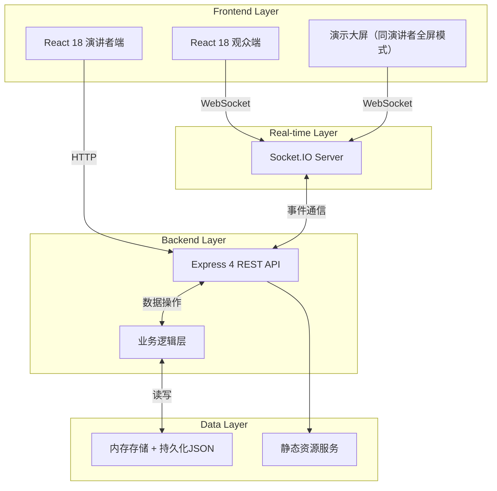
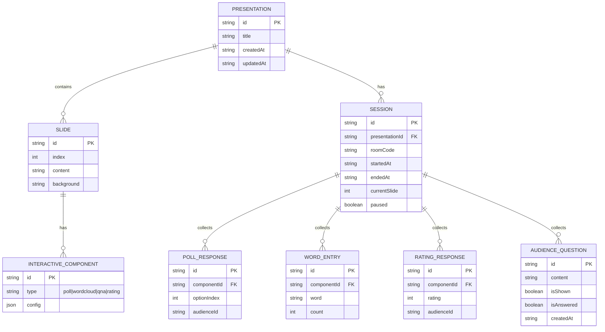

## 1. 架构设计



## 2. 技术说明

- **前端**：React@18 + TypeScript + Vite@5 + TailwindCSS@3 + Zustand（状态管理）
- **图表可视化**：Recharts（投票/评分统计图表）+ 自定义Canvas词云渲染
- **二维码生成**：qrcode.react
- **初始化工具**：vite-init，选择 react-express-ts 模板
- **后端**：Express@4 + Socket.IO@4（实时双向通信）
- **数据库**：开发阶段使用内存存储 + JSON文件持久化，无需外部数据库依赖
- **实时通信协议**：Socket.IO，支持房间（room）模式隔离不同演示会话

## 3. 路由定义

| 路由 | 页面/接口 | 用途 |
|-------|---------|---------|
| `/` | 演讲者首页 | 演示文稿列表、新建/打开入口 |
| `/editor/:presentationId` | 幻灯片编辑器 | 编辑幻灯片、插入互动组件 |
| `/present/:presentationId` | 演示控制+大屏 | 控制翻页、暂停、查看问答 |
| `/audience` | 观众首页 | 扫码/输入房间码入口 |
| `/audience/:roomCode` | 观众互动页 | 根据当前页展示互动内容 |
| `/report/:presentationId` | 数据报告页 | 查看统计、导出数据 |

## 4. Socket.IO 事件定义

```typescript
// 客户端 → 服务端
type ClientEvents = {
  'presenter:join': (data: { presentationId: string }) => void
  'presenter:navigate': (data: { presentationId: string; slideIndex: number }) => void
  'presenter:pause': (data: { presentationId: string; paused: boolean }) => void
  'presenter:end': (data: { presentationId: string }) => void
  'presenter:showQuestion': (data: { presentationId: string; questionId: string }) => void
  'presenter:markAnswered': (data: { presentationId: string; questionId: string }) => void
  
  'audience:join': (data: { roomCode: string; audienceId: string; nickname?: string }) => void
  'audience:submitPoll': (data: { roomCode: string; componentId: string; optionIndex: number }) => void
  'audience:submitWord': (data: { roomCode: string; componentId: string; word: string }) => void
  'audience:submitRating': (data: { roomCode: string; componentId: string; rating: number }) => void
  'audience:askQuestion': (data: { roomCode: string; question: string }) => void
}

// 服务端 → 客户端
type ServerEvents = {
  'room:joined': (data: { success: boolean; presentationId?: string; currentSlide?: number }) => void
  'slide:changed': (data: { slideIndex: number; slide: Slide; interactiveComponents: InteractiveComponent[] }) => void
  'presentation:paused': (data: { paused: boolean }) => void
  'presentation:ended': () => void
  
  'poll:update': (data: { componentId: string; results: PollResult }) => void
  'wordcloud:update': (data: { componentId: string; words: WordEntry[] }) => void
  'rating:update': (data: { componentId: string; results: RatingResult }) => void
  'question:new': (data: { question: AudienceQuestion }) => void
  'question:show': (data: { question: AudienceQuestion }) => void
  'question:answered': (data: { questionId: string }) => void
}
```

## 5. REST API 定义

```typescript
// 演示文稿
GET    /api/presentations              // 获取列表
POST   /api/presentations              // 新建
GET    /api/presentations/:id          // 获取详情
PUT    /api/presentations/:id          // 更新
DELETE /api/presentations/:id          // 删除

// 房间管理
POST   /api/presentations/:id/start    // 开始演示，生成房间码，返回 { roomCode, qrUrl }
GET    /api/room/:code/presentation    // 通过房间码获取演示信息

// 数据导出
GET    /api/presentations/:id/report   // 获取完整报告JSON
GET    /api/presentations/:id/export   // 导出CSV报告
```

## 6. 数据模型

### 6.1 数据模型定义



### 6.2 TypeScript 类型定义

```typescript
export type InteractiveType = 'poll' | 'wordcloud' | 'qna' | 'rating'

export interface PollConfig {
  question: string
  options: string[]
  multiSelect: boolean
}

export interface WordcloudConfig {
  prompt: string
  maxWords?: number
}

export interface RatingConfig {
  title: string
  minLabel?: string
  maxLabel?: string
  min: number
  max: number
  step: number
}

export interface QnaConfig {
  prompt: string
  anonymous: boolean
}

export interface InteractiveComponent {
  id: string
  type: InteractiveType
  config: PollConfig | WordcloudConfig | RatingConfig | QnaConfig
  position?: { x: number; y: number; width: number; height: number }
}

export interface Slide {
  id: string
  index: number
  title: string
  content: string
  background?: string
  components: InteractiveComponent[]
}

export interface Presentation {
  id: string
  title: string
  slides: Slide[]
  createdAt: string
  updatedAt: string
}
```
